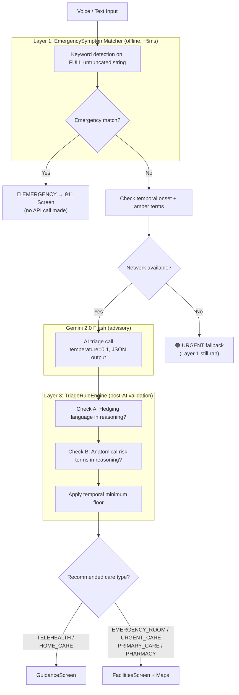
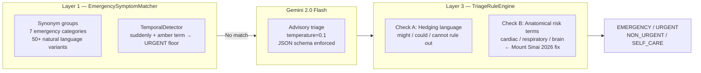
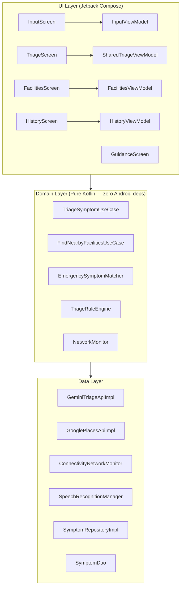
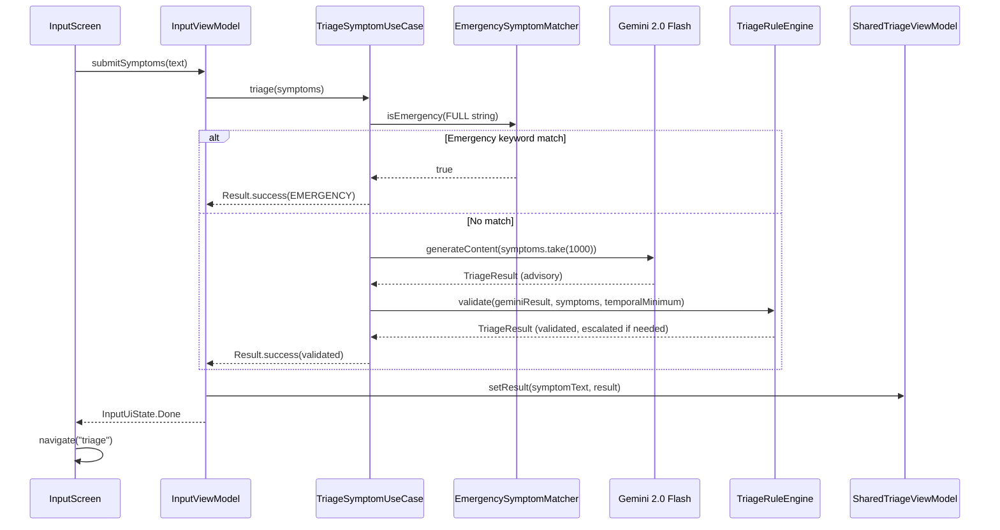

# AI Medical Symptom Pre-Screener

**Voice or text symptoms → Gemini AI triage → urgency level → nearest facility.**
Safety-critical Android app built to demonstrate defense-in-depth AI architecture.

[](https://github.com/lakshmanreddymv-bot/MedicalSymptomPreScreener/actions/workflows/ci.yml)
[](https://kotlinlang.org)
[](https://developer.android.com)
[](https://aistudio.google.com)
[](https://developers.google.com/maps)
[](app/src/test)
[](LICENSE)

**Project 4 of 4 in a portfolio of real-world AI Android apps.**
[View full portfolio →](#portfolio)

---

## Screenshots

<p align="center">
  
  
</p>
<p align="center">
  <em>Input Screen &nbsp;&nbsp;&nbsp;&nbsp;&nbsp;&nbsp;&nbsp;&nbsp;&nbsp;&nbsp;&nbsp;&nbsp;&nbsp;&nbsp;&nbsp;&nbsp;&nbsp;&nbsp;&nbsp;&nbsp; Emergency Screen (red)</em>
</p>

<p align="center">
  
  
</p>
<p align="center">
  <em>Urgent Screen (orange) &nbsp;&nbsp;&nbsp;&nbsp;&nbsp;&nbsp;&nbsp;&nbsp;&nbsp;&nbsp;&nbsp; Guidance Screen</em>
</p>

<p align="center">
  
  
</p>
<p align="center">
  <em>Facilities Map Screen &nbsp;&nbsp;&nbsp;&nbsp;&nbsp;&nbsp;&nbsp;&nbsp;&nbsp;&nbsp;&nbsp;&nbsp;&nbsp; History Screen</em>
</p>

---

## The Problem

- **40% of ER visits are unnecessary**, costing $32B+ annually in the US
- Rural areas have zero access to doctors — the nearest hospital may be 2+ hours away
- People don't know when to seek urgent vs. non-urgent care
- Every minute of delay in real emergencies costs lives

---

## ⚠️ Safety Disclaimer

> **This app is NOT a substitute for professional medical advice, diagnosis, or treatment.**
> It provides triage guidance only — it does not diagnose conditions and does not suggest medications.
> **Always call 911 for life-threatening emergencies.**
> Always consult a qualified healthcare professional.

---

## Features

- **Three-layer defense-in-depth safety architecture** — deterministic safety overrides AI
- **Voice symptom input** with real-time transcript display (Android SpeechRecognizer)
- **Gemini 2.0 Flash AI triage** — advisory layer only, temperature 0.1 for consistency
- **Google Maps nearby facilities** — Places API v1, urgency-mapped type search
- **Dedicated guidance for telehealth/home care** — no misleading empty map for virtual care
- **Offline safe** — URGENT minimum returned when no network (Layer 1 still runs)
- **Scan history** with Room persistence and swipe-to-delete
- **CI/CD** with GitHub Actions — unit tests + debug build on every push
- **Clean Architecture + MVVM + Hilt + UDF** throughout

---

## How It Works — AI Triage Pipeline



**Iron rule: EMERGENCY is always a floor. Deterministic code is authoritative. Gemini is advisory.**

---

## Three-Layer Safety Architecture

Most AI triage apps call an AI and trust the result. This app doesn't.

The 2026 Mount Sinai study found that state-of-the-art AI models undertriage **52% of emergencies**
via "paradoxical safety explanations" — the AI recognizes danger in its reasoning but still advises
waiting. This app builds the explicit fix.



| Layer | Component | Type | Role | Tests |
|---|---|---|---|---|
| 1 | EmergencySymptomMatcher | Deterministic | Fires before any AI call. EMERGENCY = immediate, no network. | 25 |
| 2 | Gemini 2.0 Flash | Advisory AI | Complex symptom assessment. Temperature 0.1. Single-turn only. | — |
| 3 | TriageRuleEngine | Post-AI Validator | Catches AI under-triaging. Hedging + anatomical term checks. | 16 |

---

## Architecture

### Clean Architecture



### Unidirectional Data Flow (UDF)



---

## Key Engineering Decisions

| Decision | What | Why |
|---|---|---|
| 1. NetworkMonitor interface | Abstracts ConnectivityManager | Fully testable — mock returns false in unit tests. No Android framework in domain. |
| 2. `emergencyResult()` hardcoded | EMERGENCY text is locked in code | Gemini can never influence the 911 call message. Deterministic, auditable. |
| 3. SharedTriageViewModel (NavGraph scope) | TriageResult held in memory across screens | `List<String>` can't serialize as nav args. NavGraph scope avoids serialization entirely. |
| 4. RECORD_AUDIO permission in UI layer only | Permission check in InputScreen, not InputViewModel | ViewModels must not request permissions — clean separation, testable ViewModel. |
| 5. TELEHEALTH/HOME_CARE → GuidanceScreen | Skip Places API for virtual/home care | Calling Places API for TELEHEALTH returns meaningless results. Dedicated screen is honest. |
| 6. `speechErrorToMessage()` maps all 9 codes | All SpeechRecognizer.ERROR_* constants handled | Users see "Network error. Use text input instead." not error code 4. |
| 7. Layer 1 runs on FULL string | Truncation only before Gemini, not before keyword match | Emergency keyword at char 1001 would be silently missed if truncated first. |

---

## Tech Stack

| Component | Technology |
|---|---|
| Language | Kotlin 2.2.10 |
| UI | Jetpack Compose + Material 3 |
| Architecture | Clean Architecture + MVVM + Hilt 2.59.1 |
| AI / Triage | Gemini 2.0 Flash (v1beta) via Retrofit |
| Maps | Google Maps Compose + Places API v1 |
| Voice Input | Android SpeechRecognizer (built-in) |
| Text-to-Speech | Android TextToSpeech (built-in) |
| Database | Room 2.7.1 |
| Permissions | Accompanist Permissions 0.37.0 |
| Networking | Retrofit 2.11.0 + OkHttp 4.12.0 |
| DI | Hilt (Dagger) |
| Testing | JUnit4 + Mockito-Kotlin + Coroutines-Test |
| CI/CD | GitHub Actions |

---

## Setup

### Prerequisites

- Android Studio Ladybug or later
- Android SDK 36
- Gemini API key ([get one free at aistudio.google.com](https://aistudio.google.com/app/apikey))
- Google Maps API key (enable Maps SDK + Places API at Google Cloud Console)

### Clone

```bash
git clone https://github.com/lakshmanreddymv-bot/MedicalSymptomPreScreener.git
cd MedicalSymptomPreScreener
```

### Configure API Keys

Add to `local.properties` (this file is gitignored — never commit it):

```properties
gemini.api.key=YOUR_GEMINI_API_KEY
maps.api.key=YOUR_MAPS_API_KEY
```

### Build and Run

```bash
./gradlew assembleDebug        # build debug APK
./gradlew installDebug         # install on connected device or emulator
./gradlew test                 # run all 67 unit tests
```

**No API keys needed for safety layer testing.** The 67 unit tests mock the Gemini API.
`local.defaults.properties` provides `PLACEHOLDER` values for CI builds.

---

## Unit Tests

| Test Class | Tests | What It Verifies |
|---|---|---|
| EmergencySymptomMatcherTest | 25 | Keyword synonym groups, natural language variants, temporal detection |
| TriageRuleEngineTest | 16 | Hedging language escalation, anatomical term escalation, three-layer ordering |
| UrgencyLevelOrderingTest | 6 | Enum ordinal safety invariant — reorder = immediate test failure |
| TriageSymptomUseCaseTest | 12 | Gemini down, offline fallback, full-string Layer 1 invariant |
| FacilitiesFailureModeTest | 7 | TELEHEALTH/HOME_CARE skip logic, all care type routing |
| **Total** | **67** | **0 failures** |

`UrgencyLevelOrderingTest` is the sentinel — if anyone reorders the `UrgencyLevel` enum
(e.g. for readability), this test fails immediately with a clear message before production code is affected.

### Run tests

```bash
./gradlew test
```

Test reports: `app/build/reports/tests/testDebugUnitTest/index.html`

---

## Bugs Fixed During Build

| # | Bug | Root Cause | Fix |
|---|---|---|---|
| 1 | KSP plugin not found | `2.2.10-1.0.29` doesn't exist for KSP | Checked gradle cache — correct version is `2.2.10-2.0.2` |
| 2 | Hilt "Android BaseExtension not found" | `hilt = "2.56"` doesn't exist | Checked gradle cache — correct version is `2.59.1` |
| 3 | "Cannot add extension 'kotlin'" | `kotlin-android` + `kotlin-compose` conflict in Kotlin 2.2.x | Removed `kotlin-android` plugin — compose plugin includes it |
| 4 | `kotlinOptions {}` Unresolved reference | AGP 9.x removed `kotlinOptions` block | Deleted `kotlinOptions {}` entirely |
| 5 | Manifest merger failed `MAPS_API_KEY` | Secrets plugin strips dots → `maps.api.key` becomes `mapsapikey` | Changed manifest meta-data to `${mapsapikey}` |
| 6 | `SwipeToDismiss` Unresolved reference | Removed in recent Material3 | Replaced with `SwipeToDismissBox` + `SwipeToDismissBoxValue` |
| 7 | "throat is closing" not detected | `"throat closing"` in set but `"my throat is closing"` doesn't contain substring | Added `"throat is closing"` to allergic emergency group |
| 8 | `doAnswer` required for suspend mock exceptions | Mockito `thenThrow` rejects checked exceptions on Kotlin suspend functions | Used `doAnswer { throw IOException() }.whenever(mock).triage(any())` |

---

## Real-World Use Cases

| Scenario | Input | Result |
|---|---|---|
| Parent with sick child | "My child has had a fever for 3 days" | NON_URGENT → Primary Care |
| Cardiac emergency | "Chest pain and I can't breathe" | EMERGENCY → 911 (Layer 1 keyword match) |
| Rural patient | "Severe headache, 2 hours from hospital" | URGENT → nearest urgent care shown |
| Anaphylaxis variant | "My throat is closing" | EMERGENCY → 911 (synonym group match) |
| Mount Sinai paradox | Gemini reasoning: "cardiac involvement" + urgency: NON_URGENT | URGENT (Layer 3 anatomical term escalation) |
| No network | Any symptoms, offline device | URGENT minimum shown, never SELF_CARE |
| Telehealth recommendation | "Mild fatigue, no fever" → TELEHEALTH | GuidanceScreen with virtual visit options, no empty map |

---

## Ethical Considerations

- **AI as advisor, not decision maker.** Deterministic safety rules always override Gemini's output.
- **Fail-safe design.** When uncertain, the system escalates — false positives (over-triage) are preferable to missed emergencies.
- **No health data leaves the device** beyond the Gemini API call, which is subject to Google's privacy policy.
- **Transparent about AI limitations.** Every screen shows the disclaimer. The UI never implies diagnosis.
- **No medications suggested.** System instruction explicitly prohibits medication recommendations.
- **911 is always prominent.** Emergency escalation is the first response for detected emergencies, not a footnote.

---

## Roadmap

- [ ] Wearable integration (heart rate + SpO2 context from Wear OS)
- [ ] Multi-language symptom input (Spanish, Mandarin)
- [ ] Offline Gemini model (on-device triage for rural zero-connectivity areas)
- [ ] Integration with insurance provider APIs (coverage-aware facility ranking)
- [ ] Pediatric symptom profiles (age-adjusted urgency thresholds)

---

## Portfolio

| Project | Description | Tech |
|---|---|---|
| [MySampleApplication-AI](https://github.com/lakshmanreddymv-bot/MySampleApplication-AI) ✅ | AI Natural Language Search | Gemini API + Clean Architecture |
| [FakeProductDetector](https://github.com/lakshmanreddymv-bot/FakeProductDetector) ✅ | Counterfeit detection ($500B problem) | Gemini Vision + Claude Haiku |
| [EnterpriseDocumentRedactor](https://github.com/lakshmanreddymv-bot/EnterpriseDocumentRedactor) ✅ | GDPR/HIPAA PII redaction, fully offline | ML Kit OCR + on-device AI |
| **MedicalSymptomPreScreener** ✅ | **Safety-critical AI triage** | **Gemini + Three-layer safety** |

---

## License

MIT License — see [LICENSE](LICENSE)

---

## Author

**Lakshmana Reddy** — Android Tech Lead, 12 years experience
Building AI-powered Android apps | Pleasanton, California

[GitHub](https://github.com/lakshmanreddymv-bot) | lakshmanreddymv@gmail.com
